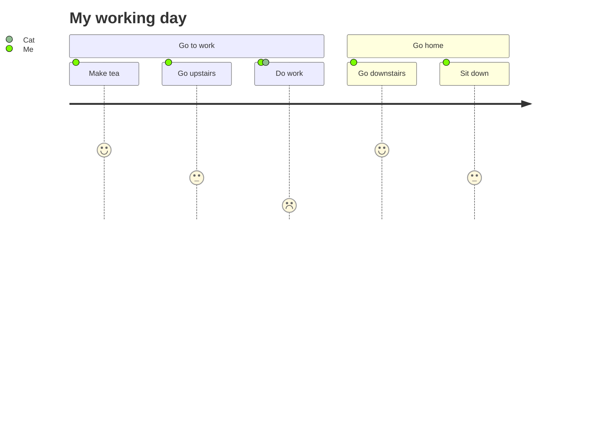

# DOM Manipulation

- [DOM Manipulation](#dom-manipulation)
  - [Basic Example](#basic-example)
  - [The Document Interface](#the-document-interface)
  - [Document.getElementById](#documentgetelementbyid)
  - [Document.createElement](#documentcreateelement)
  - [The Node interface](#the-node-interface)
  - [Node.appendChild](#nodeappendchild)
  - [Difference between children and childNodes](#difference-between-children-and-childnodes)
  - [The querySelector and querySelectorAll methods](#the-queryselector-and-queryselectorall-methods)
  - [Interested in learning more?](#interested-in-learning-more)
  - [Comparison table](#comparison-table)
  - [Link to other documents](#link-to-other-documents)
  - [How about draw diagrams](#how-about-draw-diagrams)
  - [Let do a project](#let-do-a-project)

> An exploration into the HTMLElement type

In the 20+ years since its standardization, JavaScript has come a very long way. While in 2020, JavaScript can be used on servers, in data science, and even on IoT devices, it is important to remember its most popular use case: web browsers.

Websites are made up of HTML and/or XML documents. These documents are static, they do not change. The Document Object Model (DOM) is a programming interface implemented by browsers in order to make static websites functional. The DOM API can be used to change the document structure, style, and content. The API is so powerful that countless frontend frameworks (jQuery, React, Angular, etc.) have been developed around it in order to make dynamic websites even easier to develop.

TypeScript is a typed superset of JavaScript, and it ships type definitions for the DOM API. These definitions are readily available in any default TypeScript project. Of the 20,000+ lines of definitions in lib.dom.d.ts, one stands out among the rest: `HTMLElement` . This type is the backbone for DOM manipulation with TypeScript.

## Basic Example

Given a simplified *index.html* file:

```html
<!DOCTYPE html>
<html lang="en">
  <head><title>TypeScript Dom Manipulation</title></head>
  <body>
    <div id="app"></div>
    <!-- Assume index.js is the compiled output of index.ts -->
    <script src="index.js"></script>
  </body>
</html>
```

Let’s explore a TypeScript script that adds a `<p>Hello, World!</p>` element to the #app element.

After compiling and running the index.html page, the resulting HTML will be:

```
<div id="app">
  <p>Hello, World!</p>
</div>
```

## The Document Interface

## Document.getElementById

## Document.createElement

## The Node interface

## Node.appendChild

## Difference between children and childNodes

## The querySelector and querySelectorAll methods

## Interested in learning more?

Interested in learning more?
The best part about the lib.dom.d.ts type definitions is that they are reflective of the types annotated in the Mozilla Developer Network (MDN) documentation site. For example, the HTMLElement interface is documented by this [HTMLElement][label] page on MDN. These pages list all available properties, methods, and sometimes even examples. Another great aspect of the pages is that they provide links to the corresponding standard documents. Here is the link to the W3C Recommendation for HTMLElement.

[label]: https://developer.mozilla.org/docs/Web/API/HTMLElement

Sources:

- [ECMA-262 Standard][label2]
- [Introduction to the DOM][label3]

## Comparison table

| Solution1 | Solution2 | Solution3 |
| --------- | --------- | --------- |
| Item1.1   | Item2.1   | Item3.1   |
| Item1.2   | Item2.2   | Item3.2   |
| Item1.3   | Item2.3   | Item3.3   |

## Link to other documents

1. [Subtopic1](Subtopic1..md)
2. [Subtopic2](Subtopic2.md)
   - [Subsection](Subtopic2.md#this-is-subtopic2)

## How about draw diagrams

Sure!

We can use [mermaid](https://mermaid-js.github.io/) or [plantuml](https://plantuml.com/zh/).

These two diagrams can be very useful for programmers.



## Let do a project

[label2]: http://www.ecma-international.org/ecma-262/10.0/index.html
[label3]: https://developer.mozilla.org/docs/Web/API/Document_Object_Model/Introduction